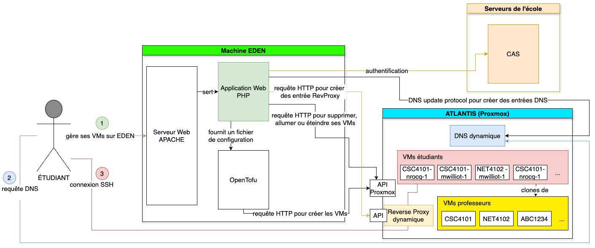
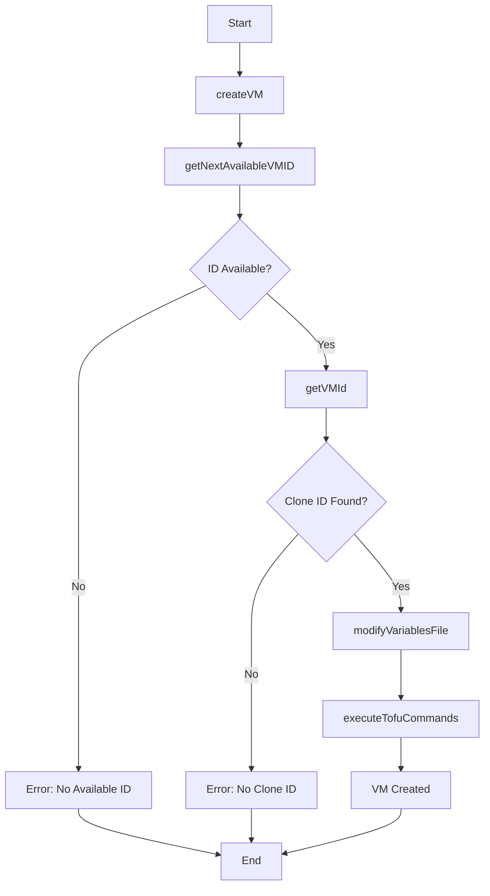

# EDEN
Projet EDEN - 2024

```mermaid
graph TD
    A[Start] --> B[createVM]
    B --> C[getNextAvailableVMID]
    C --> D{ID Available?}
    D -- Yes --> E[getVMId]
    D -- No --> F[Error: No Available ID]
    E --> G{Clone ID Found?}
    G -- Yes --> H[modifyVariablesFile]
    G -- No --> I[Error: No Clone ID]
    H --> J[executeTofuCommands]
    J --> K[VM Created]
    F --> L[End]
    I --> L
    K --> L
```